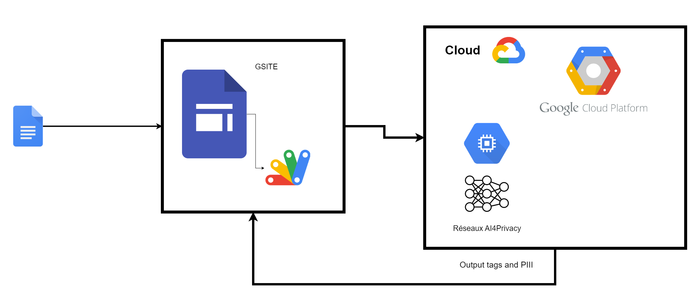

# PII Detection on Google Platforms

This project leverages the neural network developed by [AI4Privacy](https://ai4privacy.com/) to detect personally identifiable information (PII) across various Google platforms. It utilizes Docker for deployment in cloud environments, ensuring scalable and secure operations.

  
   
  <em>Data Framework</em>

## Project Overview

The project is integrated within a Google Site, using Google Apps Script for both front-end and back-end development to interact with the Google Cloud Platform. It simplifies the process of sending JSON requests to a Google Compute Engine container, which then identifies and returns the PII detected. The application segments and parses text inputs efficiently, ensuring optimal tokenization for the neural network's processing needs.

## Features

- **Cloud-Based Neural Network**: Utilizes a Docker container to deploy a neural network that specializes in PII detection.
- **Integration with Google Workspace**: Seamlessly integrates with Google services through Apps Script and Google Sites.
- **Efficient Text Parsing**: Implements a simple yet effective parsing algorithm to prepare text for PII detection.

## Getting Started

Follow the detailed guide on setting up and running this project in the most cost-effective manner on Google Cloud Platform:

[Setup and Deployment Guide](Tutorial.md)

## Contributing

We encourage contributions to this project! If you have suggestions for improvements or want to contribute code, please feel free to fork the repository and submit a pull request.

## License

This project is licensed under the MIT License - see the [LICENSE](LICENSE) file for details.

## Acknowledgements

- Thanks to AI4Privacy for providing the neural network model.
- Google Cloud Platform for providing free credits to students and access to computing resources.

Enjoy using the PII Detection on Google Platforms, and please suggest any improvements!
